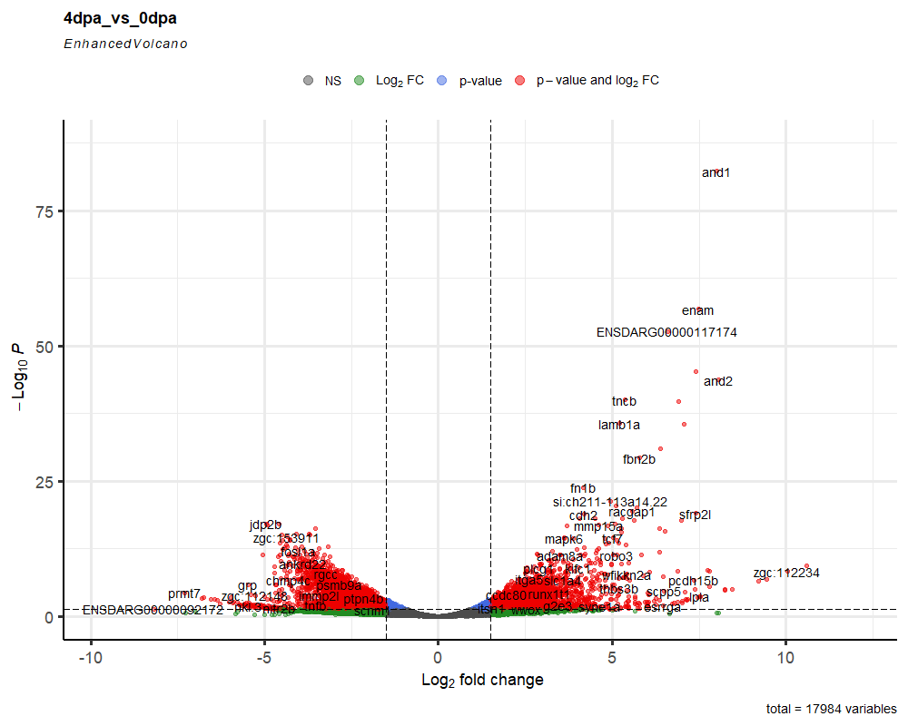
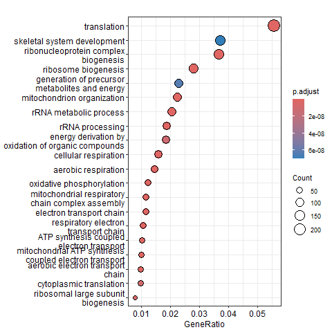

# 🧬 Zebrafish Fin Regeneration - Bulk RNA-seq Analysis

This project analyzes bulk RNA-seq data from zebrafish caudal fin regeneration at different time points (0dpa, 1dpa, 4dpa) to investigate differential gene expression and pathway regulation, with a special focus on RNA Polymerase I–related genes.

The bulk RNA-seq data analysed in this project was taken from GEO omnibus, Series GSE231956.


## 🗂️ Project Structure

```
bulk_rnaseq_zebrafish_regeneration/
├── README.md
├── environment.yml
├── samples.csv
├── ref_genome/
│   └── Danio_rerio.GRCz11.111.gtf
├── data/
│   └── salmon_quant/
├── scripts/
│   ├── 01_tximport_deseq2.R
│   ├── 02_plots_volcano_heatmap.R
│   ├── 03_enrichment_analysis.R
│   └── 04_polI_analysis.R
├── results/
│   ├── plots/
│   └── tables/
```

## 🧪 Biological Context
Zebrafish have a remarkable ability to regenerate their caudal fins. Understanding the transcriptomic landscape during early stages of regeneration (1 and 4 days post-amputation, dpa) can reveal gene regulatory networks critical for wound response, proliferation, and tissue patterning. We explore key differentially expressed genes and pathways, focusing on RNA Polymerase I machinery.

## ⚙️ Workflow Overview

1. Transcript quantification with **Salmon** (pre-processed)
2. Transcript-to-gene mapping using **makeTxDbFromGFF**
3. Gene-level expression analysis via **tximport** + **DESeq2**
4. Pairwise DE comparisons (1dpa vs 0dpa, 4dpa vs 0dpa, 4dpa vs 1dpa)
5. Visualization:
    - MA and Volcano plots
    - Top 50 DE genes heatmaps
    - Venn diagrams of overlap
    - RNA Polymerase I–specific gene expression
6. Functional enrichment:
    - GO BP and KEGG pathway analysis
    - Network visualizations (emapplots)

## 📦 Dependencies
Install via conda:
```bash
conda env create -f environment.yml
conda activate rnaseq-zfish
```

## 📊 Sample Output

### Volcano Plot (4dpa vs 0dpa)


### GO Enrichment Dotplot


## 🧬 RNA Polymerase I Focus
We extract and visualize expression of genes involved in RNA Polymerase I activity including **rrn3, taf1b, polr1b, polr1e** and examine their DE status and heatmap patterns.

## 📜 License
MIT License

## 📫 Contact
Created by Akshat Jaiswal (Biomedical Engineering @ IIT Ropar) | ([Linkedin](https://www.linkedin.com/in/akshat-jaiswal-b06a93195/)) | Email ID: akshat.biio@proton.me

---

## 🧠 Citation / Inspiration
- DESeq2: Love et al., Genome Biology 2014
- clusterProfiler: Yu et al., OMICS 2012
- Zebrafish Regeneration: Marques et al., 2019
