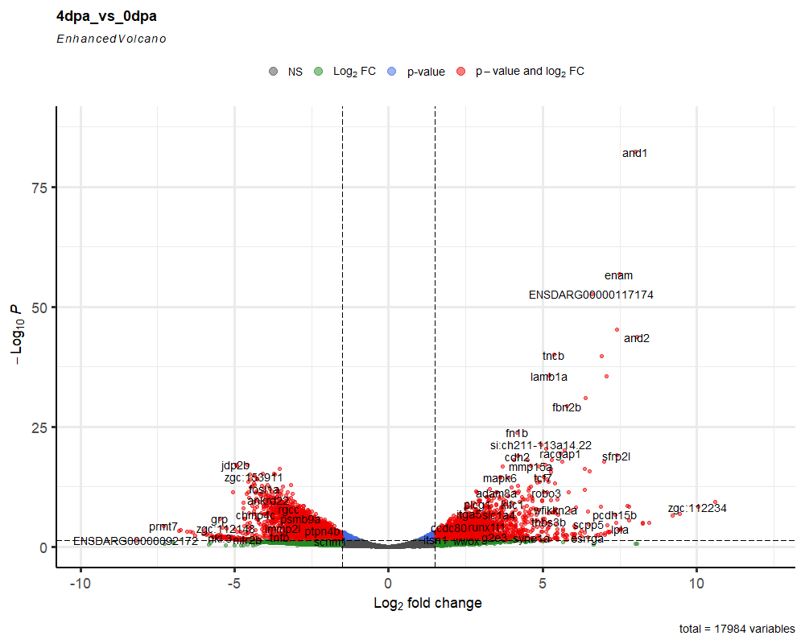
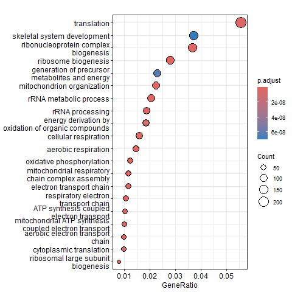

# Zebrafish Fin Regeneration — Bulk RNA-seq

A public-data transcriptomics project examining gene-expression changes at 0, 1, and 4 days post-amputation during zebrafish caudal-fin regeneration.

[](LICENSE)
[](https://omicsflowlab.netlify.app/)
[](https://www.ncbi.nlm.nih.gov/geo/query/acc.cgi?acc=GSE231956)

## Research focus

The project investigates early and later transcriptional responses after fin amputation, with particular attention to regeneration pathways and RNA Polymerase I / ribosome-biogenesis genes.

## Study at a glance

| Item | Details |
|---|---|
| Dataset | GEO GSE231956 |
| Organism | *Danio rerio* |
| Time points | 0, 1, and 4 days post-amputation |
| Comparisons | 1 dpa vs 0 dpa; 4 dpa vs 0 dpa; 4 dpa vs 1 dpa |
| Core stack | Salmon, tximport, DESeq2, `clusterProfiler`, and `enrichplot` |
| Focused genes | `rrn3`, `taf1b`, `polr1b`, and `polr1e` |

## Workflow

1. Quantify transcripts with Salmon.
2. Map transcript-level estimates to genes.
3. Import counts with `tximport`.
4. Fit pairwise differential-expression contrasts with DESeq2.
5. Review effect sizes, significance, and top-gene heatmaps.
6. Perform GO and KEGG enrichment.
7. Examine RNA Polymerase I-related genes across regeneration stages.

## Selected outputs

| Differential expression | Functional enrichment |
|---|---|
|  |  |

The volcano plot summarizes effect size and statistical evidence for the 4 dpa versus 0 dpa contrast. The enrichment plot groups significant genes into higher-level biological processes to support interpretation beyond individual genes.

## Reproducible environment

The R environment is recorded in [`environment.yml`](environment.yml):

```bash
conda env create -f environment.yml
conda activate rnaseq-zfish
```

## Interpretation note

Pathway enrichment is a hypothesis-generating layer, not proof of pathway activity. Results should be interpreted with the experimental design, background-gene universe, effect directions, and independent validation in mind.

## Portfolio note

This repository uses public data and contains no client or confidential material. It demonstrates a practical bulk RNA-seq workflow, focused biological questioning, and research-facing visualization.

## Work with me

I support wet-lab teams with bulk RNA-seq analysis, focused re-analysis, reproducible code, and manuscript-ready figures.

- [Omics Flow Lab](https://omicsflowlab.netlify.app/)
- [LinkedIn](https://www.linkedin.com/in/akshat-jaiswal-i-omics-flow-lab-9234b5384/)
- [omicsflow.lab@gmail.com](mailto:omicsflow.lab@gmail.com)
